# Mapa del Proceso de Correctness

Este documento describe el flujo completo del proceso de procesamiento de commits con breaking changes.

## Diagrama de Flujo Principal

```mermaid
graph TD
    A[Inicio: process_breaking_commits.py] --> B[Validar rutas de entrada]
    B --> C[Crear directorios de salida]
    C --> D[CommitResolver: Resolver commits del JSON]
    D --> E{¿Hay commits?}
    E -->|No| F[Error: No commits]
    E -->|Sí| G[Crear CommitProcessor]
    G --> H[Para cada commit_id]
    
    H --> I[CommitProcessor.process]
    I --> J{skip_existing_commits?}
    J -->|Sí y existe| K[Saltar commit]
    J -->|No o no existe| L[Cargar metadata]
    
    L --> M[BenchmarkMetadataLoader.load_project_id]
    M --> N[Limpiar carpeta combined_output]
    N --> O{¿Proyecto ya existe?}
    
    O -->|Sí| P[Saltar extracción Docker]
    O -->|No| Q[DockerOps: Pull imagen]
    Q --> R[DockerOps: Crear contenedor]
    R --> S[DockerOps: Copiar proyecto del contenedor]
    S --> T[DockerOps: Eliminar contenedor]
    
    P --> U[Copiar proyecto a combined_output]
    T --> U
    U --> V[Copiar reglas a combined_output/rules]
    
    V --> W[TemplateAdjuster.prepare_adjusted_template]
    W --> X[Ajustar rutas en template]
    X --> Y[TemplateAdjuster.compile_template]
    
    Y --> Z{¿Hay rule mains?}
    Z -->|No| AA[NO_RULES - Marcar fallo]
    Z -->|Sí| AB[mvn compile]
    
    AB --> AC{¿Compilación OK?}
    AC -->|No| AA
    AC -->|Sí| AD[Ejecutar cada rule main]
    
    AD --> AE{¿Ejecución OK?}
    AE -->|No| AA
    AE -->|Sí| AF{¿In-place transformation?}
    
    AF -->|No| AG[Ejecutar diffs]
    AG --> AH[Reemplazar archivos del proyecto]
    AF -->|Sí| AI[Saltar diffs y reemplazo]
    
    AH --> AJ{¿compile_success?}
    AI --> AJ
    AA --> AJ
    
    AJ -->|Sí| AK[Ejecutar tests del proyecto]
    AJ -->|No| AL[Saltar tests]
    
    AK --> AM[DockerOps: Pull imagen para tests]
    AM --> AN[DockerOps: Crear contenedor]
    AN --> AO[Ejecutar mvn test pre-modificación]
    AO --> AP[Copiar proyecto modificado al contenedor]
    AP --> AQ[Ejecutar mvn test post-modificación]
    AQ --> AR[Guardar logs de tests]
    
    AL --> AS[CompilationStatusRecorder.save_status]
    AR --> AS
    
    AS --> AT[Guardar estado en compilation-results.json]
    AT --> AU{¿Más commits?}
    AU -->|Sí| H
    AU -->|No| AV[Proceso completado]
    K --> AU
```



## Componentes Principales

### 1. Entry Point: `process_breaking_commits.py`
- **Función**: Punto de entrada CLI
- **Responsabilidades**:
  - Parsear argumentos de línea de comandos
  - Validar rutas de entrada
  - Crear directorios de salida
  - Coordinar el procesamiento de commits

### 2. CommitResolver (`commit_resolver.py`)
- **Función**: Resolver IDs de commits desde JSON principal
- **Métodos**:
  - `resolve(specific_commit)`: Obtiene lista de commits a procesar
  - Soporta procesamiento de un commit específico o todos

### 3. BenchmarkMetadataLoader (`metadata_loader.py`)
- **Función**: Cargar metadata por commit
- **Métodos**:
  - `load_metadata(commit_id)`: Retorna `(project_id, docker_image)`
  - `load_project_id(commit_id)`: Retorna solo `project_id`
- **Fuente**: Archivos `<commitId>.json` en `benchmark_folder`

### 4. DockerOps (`docker_ops.py`)
- **Función**: Operaciones Docker mediante CLI
- **Métodos principales**:
  - `pull_image(image_ref, commit_id)`: Descargar imagen Docker
  - `create_container(image_ref, commit_id)`: Crear contenedor
  - `copy_from_container(...)`: Copiar archivos desde contenedor
  - `copy_to_container(...)`: Copiar archivos al contenedor
  - `exec_in_container(...)`: Ejecutar comandos en contenedor
  - `remove_container(...)`: Eliminar contenedor

### 5. CommitProcessor (`processor.py`)
- **Función**: Coordinar procesamiento por commit
- **Flujo principal** (`process()`):
  1. Verificar si debe saltarse el commit
  2. Cargar project_id desde metadata
  3. Limpiar carpeta de salida combinada
  4. Extraer proyecto desde Docker (si no existe)
  5. Copiar proyecto a carpeta combinada
  6. Copiar reglas a carpeta combinada
  7. Ajustar template con rutas correctas
  8. Compilar y ejecutar reglas
  9. Ejecutar tests (si compilación exitosa)
  10. Guardar estado de compilación

### 6. TemplateAdjuster (`template_adjuster.py`)
- **Función**: Ajustar templates y compilar reglas
- **Métodos principales**:
  - `prepare_adjusted_template()`:
    - Copiar template base a template ajustado
    - Mapear rutas `/workspace/<project_id>/...` → rutas locales
    - Ajustar `addInputResource()` y `setSourceOutputDirectory()`
    - Detectar transformación in-place
  - `compile_template()`:
    - Descubrir rule mains con inputs/outputs
    - Compilar con `mvn compile`
    - Ejecutar cada rule main con `mvn exec:java`
    - Ejecutar diffs (si no es in-place)
    - Reemplazar archivos del proyecto con versiones transformadas

### 7. CompilationStatusRecorder (`status_recorder.py`)
- **Función**: Guardar estado de compilación en JSON central
- **Datos guardados**:
  - `rule_compile_success`: Boolean
  - `errorsByFileCount`: Número de archivos con errores
  - `errorFiles`: Lista de archivos con errores
  - `originalTemplateInputs`: Rutas originales del template
  - `adjustedTemplateInputs`: Rutas ajustadas del template
  - `failureCategory`: Categoría de fallo derivada de logs

## Flujo Detallado por Fase

### Fase 1: Preparación
```
1. Resolver commits desde JSON principal
2. Validar existencia de rutas:
   - json_file
   - benchmark_folder
   - rules_folder
3. Crear directorios de salida:
   - projects_output_folder
   - combined_output_folder
```

### Fase 2: Procesamiento por Commit

#### 2.1 Verificación Inicial
- Si `skip_existing_commits=True`: verificar si commit ya está en `compilation-results.json`
- Si existe, saltar el commit

#### 2.2 Extracción de Proyecto
```
Si proyecto NO existe en projects_output_folder:
  1. Pull imagen Docker: ghcr.io/chains-project/breaking-updates:{commit_id}-breaking
  2. Crear contenedor temporal
  3. Copiar proyecto desde /{project_id} en contenedor
  4. Eliminar contenedor
```

#### 2.3 Preparación de Carpeta Combinada
```
1. Limpiar combined_output/<commit_id> si existe
2. Copiar proyecto a combined_output/<commit_id>/<project_id>
3. Copiar reglas a combined_output/<commit_id>/rules
```

#### 2.4 Ajuste de Template
```
1. Copiar template base → template ajustado
2. Buscar patrones en archivos .java:
   - launcher.addInputResource("...")
   - launcher.setSourceOutputDirectory("...")
   - String projectPath = "..."
3. Mapear rutas:
   - /workspace/<project_id>/... → combined_output/<commit_id>/<project_id>/...
4. Ajustar output directory:
   - Si in-place: usar directorio de entrada
   - Si no in-place: usar rules/transformed/
5. Inyectar imports y configuración de SniperJavaPrettyPrinter
```

#### 2.5 Compilación y Ejecución de Reglas
```
1. Descubrir rule mains:
   - Buscar clases con main() method
   - Verificar que configuren inputs/outputs
   
2. Si NO hay rule mains:
   - Marcar como NO_RULES
   - Guardar log
   - Retornar False
   
3. Si hay rule mains:
   - mvn compile (una vez)
   - Para cada rule main:
     * mvn exec:java -Dexec.mainClass=<fqcn>
   
4. Si compilación/ejecución exitosa:
   - Si NO es in-place:
     * Ejecutar diffs entre original y transformed
     * Reemplazar archivos del proyecto con transformed
```

#### 2.6 Ejecución de Tests
```
Solo si compile_success == True:

1. Pull imagen Docker desde metadata
2. Crear contenedor
3. Ejecutar mvn test (pre-modificación):
   - Guardar log en pre-modification.log
4. Copiar proyecto modificado al contenedor
5. Ejecutar mvn test (post-modificación):
   - Guardar log en after-modifications.log
6. Mantener contenedor vivo para inspección
```

#### 2.7 Guardado de Estado
```
1. Leer breaking-classifier-report.json (si existe)
2. Extraer errorsByFile
3. Leer build log para detectar NO_RULES
4. Leer after-modifications.log para categorizar fallos:
   - JAVA_VERSION_FAILURE
   - TEST_FAILURE
   - WERROR_FAILURE
   - COMPILATION_FAILURE
   - BUILD_SUCCESS
   - ENFORCER_FAILURE
   - DEPENDENCY_RESOLUTION_FAILURE
   - DEPENDENCY_LOCK_FAILURE
   - UNKNOWN
5. Guardar en compilation-results.json
```

## Estructura de Directorios

```
projects_output_folder/
└── <commitId>/
    └── <project_id>/

combined_output_folder/
├── compilation-results.json
└── <commitId>/
    ├── <project_id>/
    ├── rules/
    │   ├── <engine>-base-template/
    │   ├── <engine>-base-template-adjusted/
    │   ├── transformed/
    │   ├── original/
    │   ├── diffs/
    │   ├── breaking-classifier-report.json
    │   └── in-place-flag.json
    ├── <engine>-build.log
    ├── pre-modification.log
    └── after-modifications.log
```

## Categorías de Fallo

El sistema categoriza los fallos basándose en los logs:

1. **NO_RULES**: No se encontraron rule mains con inputs/outputs
2. **RULES_COMPILE_ERROR**: Fallo en compilación de reglas
3. **JAVA_VERSION_FAILURE**: Incompatibilidad de versión Java
4. **TEST_FAILURE**: Fallos en tests
5. **WERROR_FAILURE**: Warnings tratados como errores
6. **COMPILATION_FAILURE**: Error de compilación del proyecto
7. **BUILD_SUCCESS**: Build exitoso
8. **ENFORCER_FAILURE**: Fallo en Maven Enforcer Plugin
9. **DEPENDENCY_RESOLUTION_FAILURE**: No se pueden resolver dependencias
10. **DEPENDENCY_LOCK_FAILURE**: Fallo en dependency lock
11. **UNKNOWN**: Categoría desconocida

## Manejo de Errores

- **Por commit**: Si un commit falla, el proceso continúa con el siguiente
- **Errores fatales**: Algunos errores detienen el proceso completo:
  - FileNotFoundError: Commit JSON no encontrado
  - RuntimeError: Fallos críticos (Docker, extracción)
- **Errores no fatales**: Se registran como warnings y el proceso continúa

## Opciones de Línea de Comandos

```bash
python3 correctness/process_breaking_commits.py \
  <json_file> \                    # JSON principal con commitIds
  <benchmark_folder> \             # Carpeta con <commitId>.json
  <rules_folder> \                 # Carpeta con reglas por commitId
  <projects_output_folder> \      # Salida de proyectos extraídos
  <combined_output_folder> \       # Salida combinada (proyecto + reglas)
  --engine <spoon|javaparser> \    # Motor de reglas
  --specific_commit <commitId> \   # Opcional: procesar solo un commit
  --skip_existing_commits          # Opcional: saltar commits ya procesados
```
